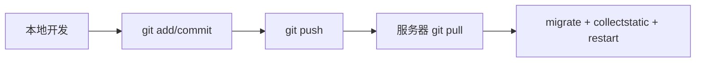

# OrganicChemHub

OrganicChemHub 是一个面向本科有机化学学习和考研复习的人名反应与合成路线资料库。支持结构式图片展示、用户注册收藏、私人笔记、学习进度追踪和站内消息通知。

当前版本：**v1.5**

部署文档：[docs/deploy_linux.md](docs/deploy_linux.md)  
更新日志：[docs/CHANGELOG.md](docs/CHANGELOG.md)

---

## 功能概览

### 数据维护
- 人名反应：中文名/英文名/SMILES/类型/标签/官能团/条件/机理/考点/适用范围/限制/参考来源/状态
- 合成路线：目标产物/摘要/难度/优缺点/来源/相关反应/状态
- 路线步骤：步骤序号/标题/反应物产物结构式/试剂/条件/产率/关联反应
- 图片字段：equation_img / mechanism_img / thumbnail_img（后台上传自动重命名）
- 学习资料：标题/分类/年份/文件类型/路径/是否含答案/状态

### 前台页面
- 首页：公告栏（滚动循环 + 关闭）、搜索栏、快速入口、最近更新反应、合成路线、学习资料、分类标签
- 反应列表：左侧滚动目录 + 右侧结果区，支持多条件筛选和排序
- 反应详情：图片结构式、概述、条件、机理、考点、收藏、学习进度（已学/待复习）、私人笔记
- 路线列表/详情：目标产物结构式、步骤时间线、反应物/产物图片
- 学习资料列表：搜索/分类/含答案筛选/排序
- 意见反馈：类型选择 / 名称 / 邮箱 / 内容，提交后可查回复与状态
- 用户注册/登录/退出

### 用户系统
- 注册/登录（用户名 + 邮箱 + 密码）
- 收藏反应和路线（❤️ 切换）
- 私人笔记（反应/路线详情页，仅自己可见）
- 学习进度追踪（待学习 / 已学 / 待复习）
- 个人中心：收藏列表 / 笔记列表 / 反馈记录 / 进度统计
- 站内消息中心：公告推送、反馈回复通知、状态变更通知（导航栏红点提示）
- 全部已读功能

### 后台管理
- 所有模型增删改查，批量发布/归档
- 图片上传（三个独立区域 + 实时预览）
- 列表缩略图列
- CSV 导出（Reaction / Route / LearningResource）
- CSV 批量导入（import_reactions_csv）
- 内容质量仪表盘（/admin/reactions/reaction/dashboard/）
- 公告管理（重要性/置顶/显示时段）
- 反馈管理（类型/状态/管理员回复/内部备注/站内消息通知）

### 自动化工具
- RDKit 批量 SVG 生成（scripts/generate_reaction_images.py）
- SMILES 备份脚本（backup_smiles，已废弃）

---

## 本地运行

```powershell
python -m venv .venv
.\.venv\Scripts\python -m pip install -r requirements.txt
.\.venv\Scripts\python manage.py migrate
.\.venv\Scripts\python manage.py loaddata common_reactions
.\.venv\Scripts\python manage.py loaddata exam_reactions
.\.venv\Scripts\python manage.py createsuperuser
.\.venv\Scripts\python manage.py runserver
```

如果默认包源无法安装 Django，可改用：

```powershell
.\.venv\Scripts\python -m pip install --index-url https://pypi.tuna.tsinghua.edu.cn/simple -r requirements.txt
```

浏览器访问：

- 前台：http://127.0.0.1:8000/
- 后台：http://127.0.0.1:8000/admin/

---

## 服务器部署

服务器目录：`/www/wwwroot/chem.wencker.top`

完整步骤见 [docs/deploy_linux.md](docs/deploy_linux.md)

部署模板文件：

- `deploy/chem.wencker.top.env.example` — 环境变量模板
- `deploy/supervisor_organicchemhub.conf` — Supervisor 守护进程配置
- `deploy/nginx_chem.wencker.top.conf` — Nginx 反向代理配置

服务器同步更新：

```bash
cd /www/wwwroot/chem.wencker.top
source .venv/bin/activate
git pull
pip install -r requirements.txt
python manage.py migrate
python manage.py collectstatic --noinput
/www/server/panel/pyenv/bin/supervisorctl restart all
```

---

## 索引本地学习资料

```powershell
.\.venv\Scripts\python manage.py index_learning_resources "F:\2027考研资料\有机化学"
```

索引只保存文件标题、分类、年份、大小和本地路径等元信息，不会复制或公开文件内容。

---

## 测试

```powershell
.\.venv\Scripts\python manage.py test
.\.venv\Scripts\python manage.py check
```

---

## 图片制作规范

反应结构式图片按照 [docs/image_production_guide.md](docs/image_production_guide.md) 的规范制作 SVG 上传。使用 ChemDraw 绘制，输出 SVG 格式，Arial 字体，透明背景。

图片自动重命名规则：`media/reaction_images/reaction_{slug}_{type}.{ext}`

---

## Git 同步流程



数据库（`db.sqlite3`）和用户上传图片（`media/`）不提交 Git，详见 [docs/git_sync_guide.md](docs/git_sync_guide.md)。

---

## 版本历史

| 版本 | 日期 | 核心内容 |
|------|------|---------|
| 1.6 | 2026-07-30 | 常见反应独立体系（新增 CommonReaction 模型 + 独立页面 + 后台管理），人脸反应与常见反应解耦为交集关系 |
| 1.5 | 2026-07-29 | 反馈升级 + 站内消息系统 |
| 1.4 | 2026-07-29 | 用户体系：注册/登录/收藏/私人笔记/学习进度/个人中心/版本号统一管理 |
| 1.3 | 2026-07-29 | 公告弹窗关闭按钮/置顶/显示时限/意见反馈表单（仅后台可见） |
| 1.2 | 2026-07-29 | CSV 导出/内容质量仪表盘/导入补充字段 |
| 0.9 | 2026-07-29 | 彻底移除 SMILES，纯图片结构式 |
| 0.8 | 2026-07-29 | RDKit 批量 SVG 生成 |
| 0.7 | 2026-07-29 | 前端清理，死 CSS 删除，移动端适配 |
| 0.6 | 2026-07-29 | 图片字段/后台重构/自动重命名 |
| 0.5 | 2026-07-29 | 图片规范/目录结构/ChemDraw |
| 0.37-0.1 | 2026-07-28 | 初始版本搭建 |

---

## 技术栈

| 层 | 技术 |
|----|------|
| 后端 | Python 3.11 / Django 5.2 LTS |
| 数据库 | SQLite（开发）/ 可迁移至 PostgreSQL |
| 前端 | Bootstrap 5.3.3 / Bootstrap Icons |
| 图片生成 | RDKit 2022.09 / ChemDraw |
| 服务器 | Gunicorn / Nginx / Supervisor |
| 部署 | 宝塔面板 10.0 / Debian 12 / LNMP |
| 同步 | Git + GitHub |
