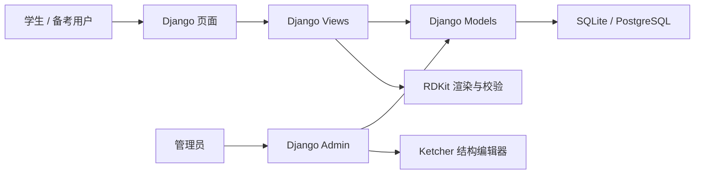
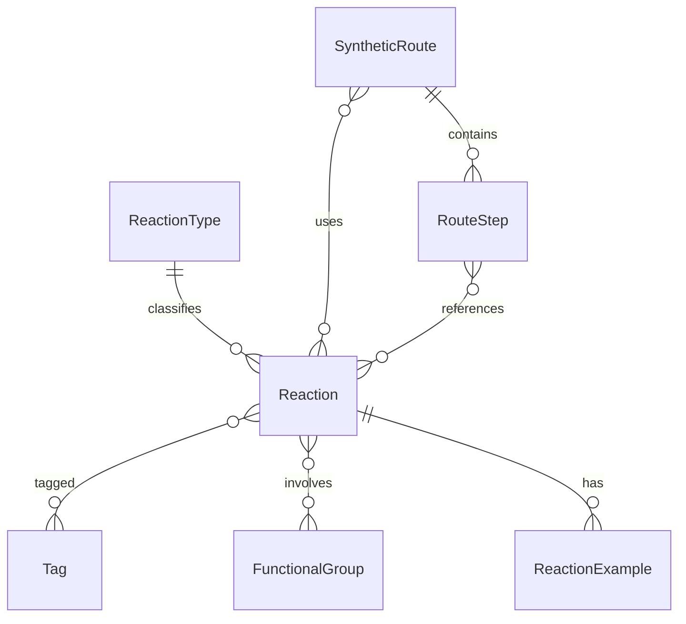

# OrganicChemHub 开发文档

版本：v1.0  
日期：2026-07-28  
项目名称：OrganicChemHub，暂定名  
项目定位：面向本科有机化学学习与考研复习的人名反应、反应机理和合成路线查询平台

---

## 1. 项目概述

### 1.1 项目背景

有机化学学习中，人名反应、官能团转化、合成路线设计往往分散在教材、讲义、题库和笔记中。学生在复习时常遇到以下问题：

- 不知道某个反应属于哪类转化，适用底物和条件是什么。
- 只记得试剂或产物，不记得反应名称。
- 合成路线题缺少对比，难以判断哪条路线更适合考试或实验。
- 机理、考点和易错点分散，复习效率低。

OrganicChemHub 的目标是把人名反应、结构式、反应条件、机理说明、考点提示和合成路线整合到一个可检索、可维护、可扩展的网站中。

### 1.2 目标用户

- 本科有机化学学生
- 考研有机化学备考者
- 需要快速查阅反应类型、试剂条件和路线设计的学习者
- 后台管理员，包括教师、助教、内容维护人员

### 1.3 核心目标

- 提供按名称、类型、试剂、官能团、关键词检索人名反应的能力。
- 提供目标分子对应的多条合成路线，并能对比优缺点。
- 将反应机理、适用范围、限制、考点、易错点集中展示。
- 后台管理员可通过 Web 界面维护反应、路线、标签、参考文献等数据，无需直接操作数据库。
- 第一阶段优先完成可用的学习资料库，后续再增强结构式检索、动画和智能评分。

### 1.4 非目标范围

第一版不建议直接做以下能力：

- 自动 retrosynthesis 逆合成推理。
- 完整实验室级电子实验记录本。
- 基于 AI 自动生成未经审核的合成路线。
- 移动 App 原生客户端。
- 高级三维分子可视化。

这些功能技术复杂度较高，适合作为后续迭代。

---

## 2. 产品范围

### 2.1 MVP 功能

第一版建议聚焦以下功能：

1. 人名反应资料库
   - 中文名、英文名、别名查询
   - 反应类型筛选
   - 试剂、催化剂、溶剂、官能团关键词查询
   - 反应详情展示

2. 合成路线资料库
   - 按目标产物名称和关键词查询
   - 多条路线列表展示
   - 每条路线的步骤、条件、优缺点、来源展示
   - 关联人名反应跳转

3. 学习辅助内容
   - 考研高频标签
   - 易错点
   - 机理说明
   - 按官能团转化或反应类型归类

4. 管理后台
   - 反应、反应类型、标签、路线、路线步骤的增删改查
   - 搜索、筛选、批量发布或下架
   - 富文本编辑机理和考点内容

### 2.2 后续迭代功能

- 结构式绘制和 SMILES 自动生成。
- 基于 RDKit 的结构式渲染。
- 基于 RDKit 的子结构检索。
- 反应机理动画。
- 用户收藏、笔记、错题本。
- 合成路线评分。
- 数据导入导出。
- REST API 与移动端适配。

---

## 3. 技术栈选型

### 3.1 推荐技术栈

| 层级 | 推荐技术 | 说明 |
| --- | --- | --- |
| 后端框架 | Django 5.2 LTS 或当前稳定版 | Django 自带 ORM、Admin、模板、权限和迁移系统，适合快速搭建内容管理型网站 |
| 数据库 | SQLite 开发，PostgreSQL 生产 | SQLite 适合本地开发；生产建议使用 PostgreSQL，便于全文检索和扩展 |
| 前端 | Django Templates + Bootstrap 5.3 | 第一版不必前后端分离，降低维护成本 |
| 前端交互 | 原生 JavaScript，必要时少量 jQuery | Bootstrap 5 已不依赖 jQuery，建议减少新项目对 jQuery 的依赖 |
| 结构编辑 | Ketcher，优先放在后台 | 方便管理员绘制结构并导出 SMILES |
| 结构处理 | RDKit | 用于 SMILES 校验、结构式 SVG 渲染、后续子结构检索 |
| 富文本 | django-ckeditor-5 或 TinyMCE | 用于机理、考点、参考资料说明 |
| 部署 | Docker + Gunicorn + Nginx | 便于固定 RDKit 等依赖环境 |
| 静态资源 | Django staticfiles + Nginx | 生产环境使用 collectstatic |

### 3.2 技术选型建议

原文中“Django 4.x”建议调整。到 2026 年 7 月，Django 4.2 LTS 已不适合作为新项目首选，建议使用 Django 5.2 LTS 或开发时官方推荐的当前稳定版。Django 5.2 LTS 更适合教学类网站长期维护。

ChemDoodle Web Components 需要确认授权方式。若只需要展示结构式，第一版更建议由 RDKit 在后端把 SMILES 渲染成 SVG，减少前端依赖和授权风险。

jQuery 可以保留给少数插件，但不建议作为新页面交互的核心依赖。Bootstrap 5 和现代浏览器原生 JavaScript 已能覆盖大部分需求。

RDKit 在 Windows 环境安装可能比普通 Python 包复杂。建议使用 Docker 或 Conda 固定环境，避免开发者机器之间出现依赖差异。

---

## 4. 系统架构

### 4.1 总体架构



### 4.2 模块划分

- reactions：人名反应、类型、标签、官能团、试剂、参考文献。
- routes：合成路线、路线步骤、路线对比。
- compounds：化合物信息，可在第二阶段加入。
- accounts：普通用户收藏、笔记，可在后续阶段加入。
- common：通用工具，如 SMILES 校验、SVG 生成、搜索辅助。

第一版可以先用一个 Django app `reactions` 承载核心模型，但如果计划长期扩展，建议从一开始区分 `reactions` 和 `routes`。

---

## 5. 数据模型设计

### 5.1 设计原则

- 反应和路线都应支持草稿、发布、下架状态。
- 合成路线步骤不建议只存一个大文本字段，否则后续无法单独排序、检索、关联反应或展示结构式。
- 标签建议定义为 Reaction 的多对多字段，而不是只在 Tag 中反向定义；这样 Admin 中 `filter_horizontal = ("tags",)` 才能正常使用。
- `Type` 名称过于通用，建议改为 `ReactionType`。
- 涉及富文本的字段需要做 HTML 清洗，避免 XSS 风险。

### 5.2 核心实体

#### ReactionType：反应类型

| 字段名 | 类型 | 说明 |
| --- | --- | --- |
| id | AutoField | 主键 |
| name | CharField(50) | 类型名称，如氧化反应、还原反应、重排反应 |
| slug | SlugField | URL 友好标识 |
| description | TextField | 类型说明 |
| sort_order | PositiveIntegerField | 前台展示排序 |

#### Tag：标签

| 字段名 | 类型 | 说明 |
| --- | --- | --- |
| id | AutoField | 主键 |
| name | CharField(50) | 标签名称，如考研高频、碳链增长 |
| slug | SlugField | URL 友好标识 |
| description | TextField | 标签说明 |

#### FunctionalGroup：官能团

| 字段名 | 类型 | 说明 |
| --- | --- | --- |
| id | AutoField | 主键 |
| name_zh | CharField(50) | 中文名，如醛基、羧基、卤代烃 |
| name_en | CharField(80) | 英文名 |
| smarts | CharField(200) | 后续用于子结构检索的 SMARTS |
| description | TextField | 说明 |

#### Reaction：人名反应

| 字段名 | 类型 | 说明 |
| --- | --- | --- |
| id | AutoField | 主键 |
| name_zh | CharField(100) | 中文名称，如维蒂希反应 |
| name_en | CharField(100) | 英文名称，如 Wittig Reaction |
| slug | SlugField | URL 标识 |
| aliases | CharField(300) | 别名，便于搜索 |
| reaction_type | ForeignKey(ReactionType) | 反应类型 |
| tags | ManyToManyField(Tag) | 标签 |
| functional_groups | ManyToManyField(FunctionalGroup) | 相关官能团 |
| equation_smiles | TextField | 反应 SMILES，建议格式为反应物>>产物 |
| summary | TextField | 简要说明 |
| condition | TextField | 反应条件 |
| mechanism | TextField | 机理说明，可用受控富文本 |
| scope | TextField | 适用范围 |
| limitations | TextField | 限制与注意事项 |
| exam_tips | TextField | 考点与易错点 |
| safety_notes | TextField | 安全或试剂注意事项 |
| reference | TextField | 参考文献或教材出处 |
| status | CharField | draft、published、archived |
| created_at | DateTimeField | 创建时间 |
| updated_at | DateTimeField | 更新时间 |

#### ReactionExample：反应实例

| 字段名 | 类型 | 说明 |
| --- | --- | --- |
| id | AutoField | 主键 |
| reaction | ForeignKey(Reaction) | 所属人名反应 |
| title | CharField(100) | 示例标题 |
| reactant_smiles | TextField | 反应物 |
| product_smiles | TextField | 产物 |
| condition | TextField | 条件 |
| yield_text | CharField(50) | 产率描述 |
| note | TextField | 说明 |

#### SyntheticRoute：合成路线

| 字段名 | 类型 | 说明 |
| --- | --- | --- |
| id | AutoField | 主键 |
| target_product | CharField(200) | 目标产物名称 |
| target_smiles | CharField(300) | 目标产物 SMILES |
| slug | SlugField | URL 标识 |
| summary | TextField | 路线摘要 |
| advantages | TextField | 优点 |
| disadvantages | TextField | 缺点 |
| difficulty | CharField | beginner、intermediate、advanced |
| source | CharField(200) | 来源 |
| related_reactions | ManyToManyField(Reaction) | 涉及的人名反应 |
| status | CharField | draft、published、archived |
| created_at | DateTimeField | 创建时间 |
| updated_at | DateTimeField | 更新时间 |

#### RouteStep：合成路线步骤

| 字段名 | 类型 | 说明 |
| --- | --- | --- |
| id | AutoField | 主键 |
| route | ForeignKey(SyntheticRoute) | 所属路线 |
| step_number | PositiveIntegerField | 步骤顺序 |
| title | CharField(100) | 步骤标题 |
| reactant_smiles | TextField | 起始物或中间体 |
| product_smiles | TextField | 产物或中间体 |
| reagents | TextField | 试剂 |
| condition | TextField | 条件 |
| yield_text | CharField(50) | 产率描述 |
| related_reactions | ManyToManyField(Reaction) | 关联人名反应 |
| note | TextField | 说明 |

### 5.3 ER 图



### 5.4 对原始设计的修正

- 原文写“Reaction 1---* SyntheticRoute”，但模型中 `related_reactions = ManyToManyField(Reaction)`，实际应为 Reaction 与 SyntheticRoute 多对多。
- 原文 Admin 中使用 `filter_horizontal = ("tags",)`，但 Reaction 模型没有定义 `tags` 字段，会报错。应在 Reaction 中加入 `tags = models.ManyToManyField(Tag, blank=True)`。
- `route_steps = TextField` 适合快速录入，但不利于后续路线对比和结构展示。建议改为独立的 `RouteStep` 表。
- 若要按试剂、官能团检索，仅用 `condition` 文本字段会比较弱。建议至少增加标签和官能团关联，后续再做结构检索。

---

## 6. 后端设计

### 6.1 Django 项目结构建议

```text
organic_chem_hub/
  manage.py
  config/
    settings.py
    urls.py
    wsgi.py
    asgi.py
  reactions/
    models.py
    admin.py
    views.py
    urls.py
    forms.py
    services/
      smiles.py
      search.py
    templates/
      reactions/
  routes/
    models.py
    admin.py
    views.py
    urls.py
    templates/
      routes/
  static/
  templates/
    base.html
  docs/
```

第一阶段也可以把 `routes` 合并进 `reactions` app，降低初始化复杂度。若你预计路线功能会持续扩展，建议拆分。

### 6.2 后端核心能力

- 数据模型与迁移。
- Django Admin 数据维护。
- 人名反应列表、详情页。
- 合成路线列表、详情页。
- 搜索与筛选表单。
- SMILES 基础校验。
- SMILES 到 SVG 的结构式渲染。
- 草稿和发布状态控制。

### 6.3 搜索策略

MVP 阶段：

- 使用 Django ORM 的 `icontains` 做名称、别名、条件、考点、摘要搜索。
- 使用类型、标签、官能团进行精确筛选。
- 给常用字段添加索引，如 `slug`、`name_zh`、`name_en`、`status`。

生产增强阶段：

- PostgreSQL 全文检索。
- 拼音或中英文别名搜索。
- RDKit 子结构检索。
- 搜索结果排序权重，如名称命中高于正文命中。

---

## 7. 管理后台设计

### 7.1 Admin 目标

管理员应能完成以下任务：

- 新增、编辑、删除反应。
- 新增、编辑、删除合成路线和路线步骤。
- 按类型、标签、状态筛选内容。
- 搜索中文名、英文名、别名、试剂条件。
- 预览结构式。
- 设置内容为草稿或发布。
- 维护参考文献和教材出处。

### 7.2 Admin 配置建议

ReactionAdmin：

- `list_display`：中文名、英文名、类型、状态、更新时间。
- `search_fields`：中文名、英文名、别名、条件、考点。
- `list_filter`：类型、标签、官能团、状态。
- `filter_horizontal`：标签、官能团。
- `prepopulated_fields`：由英文名或中文名生成 slug。
- `readonly_fields`：创建时间、更新时间。

SyntheticRouteAdmin：

- `list_display`：目标产物、难度、状态、来源、更新时间。
- `search_fields`：目标产物、摘要、来源。
- `list_filter`：难度、状态、相关反应。
- 使用 `RouteStepInline` 按步骤维护路线。

### 7.3 富文本与结构编辑

- 机理、考点、适用范围可以使用富文本编辑器。
- 富文本需要限制可用标签，并在展示时进行安全处理。
- Ketcher 建议先集成在后台编辑页面，用于生成 SMILES。
- 前台展示优先使用 RDKit 生成 SVG，保证展示稳定。

---

## 8. 前端页面设计

### 8.1 页面结构

首页：

- 顶部全局搜索框。
- 反应类型入口。
- 高频考点入口。
- 最新更新或热门反应。

反应列表页：

- 关键词搜索。
- 类型筛选。
- 标签筛选。
- 官能团筛选。
- 结果卡片展示：中文名、英文名、类型、简要说明、标签。

反应详情页：

- 反应名称、英文名、别名。
- 反应方程式结构图。
- 反应条件。
- 机理说明。
- 适用范围和限制。
- 考点与易错点。
- 反应实例。
- 相关合成路线。
- 参考文献。

合成路线列表页：

- 按目标产物搜索。
- 难度筛选。
- 关联反应筛选。
- 展示路线摘要、步数、优缺点。

合成路线详情页：

- 目标产物结构式。
- 路线总览。
- 分步骤结构变化。
- 每步试剂、条件、产率、关联反应。
- 多路线对比。

学习专题页：

- 按碳链增长归纳。
- 按官能团转化归纳。
- 按氧化还原、取代、加成、消除、重排等分类。
- 考研高频反应专题。

### 8.2 UI 风格建议

- 第一屏直接提供搜索和分类入口，不做纯宣传落地页。
- 页面应以资料检索效率为主，布局清晰、密度适中。
- 反应详情页避免大段文字堆叠，应使用分区、表格和结构式辅助阅读。
- 移动端重点保证搜索、筛选和详情阅读体验。

---

## 9. 化学结构处理方案

### 9.1 MVP 方案

- 数据库存储 SMILES 或 reaction SMILES。
- 后端使用 RDKit 校验 SMILES 是否可解析。
- 后端使用 RDKit 将 SMILES 渲染为 SVG。
- 前台直接展示 SVG。

优点：

- 展示稳定。
- 前端依赖少。
- 便于缓存。

### 9.2 后台结构编辑

- 管理员在 Admin 中打开 Ketcher。
- 绘制分子或反应。
- 导出 SMILES 或 reaction SMILES。
- 保存到对应字段。

### 9.3 后续结构检索

- 官能团筛选先通过 `FunctionalGroup` 手动标签实现。
- 后续使用 SMARTS + RDKit 实现子结构匹配。
- 生产数据库可将结构检索相关数据缓存为规范化 SMILES、InChIKey 或指纹。

---

## 10. 权限与安全

### 10.1 用户角色

- 访客：浏览已发布内容、搜索反应和路线。
- 普通用户，后续：收藏、笔记、学习记录。
- 内容管理员：维护反应和路线数据。
- 超级管理员：用户管理、权限管理、系统配置。

### 10.2 安全要求

- 生产环境必须设置 `DEBUG = False`。
- `SECRET_KEY`、数据库密码等配置使用环境变量。
- Admin 必须启用强密码策略。
- 所有表单启用 CSRF 防护。
- 富文本内容需要过滤危险 HTML。
- 文件上传限制类型和大小。
- 对公开页面只展示 `published` 状态的数据。
- 定期备份数据库和媒体文件。

---

## 11. 数据质量与内容规范

### 11.1 内容录入规范

每个人名反应建议至少包含：

- 中文名
- 英文名
- 反应类型
- 一句话摘要
- 反应方程式或典型底物转化
- 常用试剂和条件
- 机理要点
- 适用范围
- 局限性
- 考点或易错点
- 至少一个参考来源

每条合成路线建议至少包含：

- 目标产物名称
- 目标产物 SMILES
- 路线摘要
- 逐步路线
- 每步试剂和条件
- 优点
- 缺点
- 来源

### 11.2 审核状态

建议增加内容状态：

- draft：草稿，仅管理员可见。
- review：待审核。
- published：公开展示。
- archived：归档，不在普通列表展示。

### 11.3 参考来源

参考来源应尽量具体：

- 教材名称、版次、页码。
- 文献 DOI 或题名。
- 课程讲义名称和章节。
- 题库来源和题号。

注意避免直接大段复制受版权保护的教材内容，应以归纳总结为主。

---

## 12. 测试与验收

### 12.1 测试范围

模型测试：

- Reaction 创建、标签关联、类型关联。
- SyntheticRoute 与 RouteStep 顺序。
- 草稿内容不在前台展示。

搜索测试：

- 中文名搜索。
- 英文名搜索。
- 别名搜索。
- 类型筛选。
- 标签筛选。

页面测试：

- 首页可搜索。
- 反应详情页完整展示核心字段。
- 路线详情页按步骤展示。
- 移动端布局不溢出。

后台测试：

- 管理员可新增反应。
- 管理员可新增路线和步骤。
- 非管理员不能进入后台。

化学结构测试：

- 合法 SMILES 可渲染。
- 非法 SMILES 给出明确错误提示。
- 空 SMILES 不影响页面展示。

### 12.2 MVP 验收标准

- 至少录入 50 个高频人名反应。
- 至少录入 20 条合成路线。
- 用户能通过名称、类型、标签找到反应。
- 每个反应详情页能展示结构式、条件、机理、考点和参考来源。
- 管理员无需操作数据库即可维护数据。
- 生产环境能正常部署并支持备份。

---

## 13. 部署与运维

### 13.1 开发环境

- Python 版本根据 Django 所选版本确定。
- 推荐使用虚拟环境或 Docker。
- SQLite 用于本地开发。
- 使用 Django Debug Toolbar 辅助开发，可选。

### 13.2 生产环境

- Linux 服务器。
- Gunicorn 运行 Django 应用。
- Nginx 反向代理并托管静态文件。
- PostgreSQL 存储生产数据。
- 使用 HTTPS。
- 使用环境变量管理配置。
- 定期执行数据库备份。

### 13.3 部署流程

1. 拉取代码。
2. 安装依赖。
3. 配置环境变量。
4. 执行数据库迁移。
5. 执行 `collectstatic`。
6. 重启 Gunicorn 服务。
7. 检查首页、Admin、搜索和详情页。

### 13.4 备份策略

开发阶段：

- 定期备份 `db.sqlite3`。
- 每次大批量导入前先备份。

生产阶段：

- PostgreSQL 每日自动备份。
- 媒体文件每日或每周备份。
- 至少保留最近 7 天备份。
- 定期做恢复演练。

---

## 14. 开发里程碑

### 阶段 1：基础资料库

目标：完成可维护、可查询的人名反应库。

任务：

- 创建 Django 项目。
- 建立 ReactionType、Tag、FunctionalGroup、Reaction 模型。
- 配置 Admin。
- 实现首页、反应列表页、反应详情页。
- 完成关键词搜索和类型筛选。
- 录入第一批 50 个反应。

### 阶段 2：合成路线

目标：支持目标产物路线查询和步骤展示。

任务：

- 建立 SyntheticRoute 和 RouteStep 模型。
- 配置路线 Admin 和步骤 Inline。
- 实现路线列表页、路线详情页。
- 支持路线与反应关联。
- 录入第一批 20 条路线。

### 阶段 3：结构式能力

目标：提升结构展示和后台录入效率。

任务：

- 集成 RDKit SMILES 校验。
- 实现 SMILES 到 SVG 渲染。
- 在详情页展示结构式。
- 在 Admin 中集成 Ketcher。
- 对非法 SMILES 做错误提示。

### 阶段 4：学习增强

目标：增强复习体验。

任务：

- 增加学习专题页。
- 增加考研高频、易错点、官能团转化归类。
- 增加用户收藏和笔记。
- 评估是否提供 REST API。

---

## 15. 建议的项目初始化命令

```bash
django-admin startproject config .
python manage.py startapp reactions
python manage.py startapp routes
python manage.py makemigrations
python manage.py migrate
python manage.py createsuperuser
```

如果先用单 app 简化，也可以只创建 `reactions`，后续再拆分。

---

## 16. 推荐依赖

基础依赖：

```text
Django
gunicorn
psycopg[binary]
python-dotenv
django-ckeditor-5
```

可选依赖：

```text
djangorestframework
django-filter
django-import-export
rdkit
```

说明：

- `djangorestframework` 只有在需要前后端分离或开放 API 时再引入。
- `django-filter` 可简化复杂筛选。
- `django-import-export` 适合批量导入反应数据。
- `rdkit` 建议通过 Conda 或 Docker 固定安装环境。

---

## 17. 风险与应对

| 风险 | 影响 | 应对 |
| --- | --- | --- |
| 数据录入量大 | MVP 进度变慢 | 先录入高频反应，建立模板和导入流程 |
| 化学结构依赖安装复杂 | 开发环境不稳定 | 使用 Docker 或 Conda 固定环境 |
| 富文本存在 XSS 风险 | 安全问题 | 限制富文本标签并清洗 HTML |
| 路线步骤只存文本 | 后续无法检索和对比 | 使用 RouteStep 表结构化存储 |
| 前后端分离过早 | 开发复杂度上升 | 第一版使用 Django 模板 |
| 资料版权问题 | 上线风险 | 使用归纳内容，标注来源，避免大段复制 |
| SQLite 用于生产 | 并发和备份能力弱 | 生产切换 PostgreSQL |

---

## 18. 资料核对链接

以下链接用于技术选型核对，正式开发时应以官方页面当前内容为准：

- Django 下载与版本信息：https://www.djangoproject.com/download/
- Django 发布周期说明：https://docs.djangoproject.com/en/dev/internals/release-process/
- Bootstrap 官方文档：https://getbootstrap.com/docs/
- Ketcher 项目：https://github.com/epam/ketcher
- RDKit 官方文档：https://www.rdkit.org/docs/
- Django REST Framework：https://www.django-rest-framework.org/

---

## 19. 总结建议

这个项目适合采用 Django 内容管理型架构，而不是一开始做复杂的前后端分离。第一版最重要的是把反应和路线数据结构设计好，并让后台维护足够顺手。

最建议调整的地方有四个：

1. Django 4.x 改为 Django 5.2 LTS 或当前稳定版。
2. 合成路线步骤从 TextField 拆成 RouteStep 表。
3. Reaction 模型补充 tags 字段，修正 Admin 配置不一致。
4. 第一版前台结构展示优先用 RDKit 生成 SVG，Ketcher 先用于后台录入。

按这个范围推进，OrganicChemHub 可以先做成一个稳定、实用、内容质量可控的学习资料库，再逐步演进为结构检索和路线智能分析平台。
